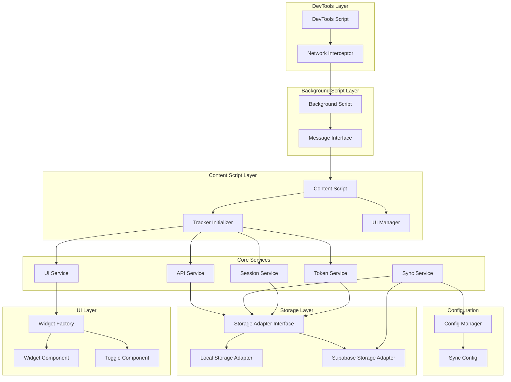

# Design Document

## Overview

This design transforms the existing ChatGPT token tracking extension into a modular, maintainable system with optional Supabase synchronization. The architecture follows dependency injection principles and clear separation of concerns to enable easy testing, modification, and extension of functionality.

The system will be restructured into distinct layers: Core Services, Storage Adapters, UI Components, and Configuration Management. Each layer will have well-defined interfaces and minimal coupling to other layers.

## Architecture

### High-Level Architecture



### Module Dependencies

The system will use a dependency injection container to manage module relationships:

- **Core Services** depend only on interfaces, not concrete implementations
- **Storage Adapters** implement common interfaces for data persistence
- **UI Components** receive data through props and emit events through callbacks
- **Configuration** is injected into services that need it

## Components and Interfaces

### 0. DOM Extraction Layer

#### DOM Parser and Monitor

The extension will use DOM extraction instead of API interception for more reliable and stable data capture:

```typescript
// DOM extraction approach
interface ParsedMessage {
  id: string;
  role: "user" | "assistant";
  content: string;
  timestamp?: string;
}

interface ParsedConversation {
  conversation_id: string;
  title?: string;
  messages: ParsedMessage[];
}

export function parseChatGPTFromDOM(): ParsedConversation | null {
  // Extract conversation ID from URL
  const url = window.location.href;
  const conversationId = url.match(/\/c\/([a-f0-9-]+)/)?.[1];

  if (!conversationId) return null;

  // Extract conversation turns from DOM
  const conversationTurns = document.querySelectorAll(
    '[data-testid^="conversation-turn"]'
  );
  const messages: ParsedMessage[] = [];

  conversationTurns.forEach((turn, index) => {
    const messageContainer = turn.querySelector("[data-message-author-role]");
    if (!messageContainer) return;

    const role = messageContainer.getAttribute("data-message-author-role") as
      | "user"
      | "assistant";
    const messageId =
      messageContainer.getAttribute("data-message-id") || `turn-${index}`;

    let content = "";
    if (role === "user") {
      const userContent = messageContainer.querySelector(
        ".whitespace-pre-wrap"
      );
      content = userContent?.textContent?.trim() || "";
    } else if (role === "assistant") {
      const assistantContent = messageContainer.querySelector(
        '.markdown.prose, [class*="markdown"], [class*="prose"]'
      );
      content = assistantContent
        ? extractAssistantContent(assistantContent)
        : "";
    }

    if (content && content.length > 0) {
      messages.push({ id: messageId, role, content });
    }
  });

  return {
    conversation_id: conversationId,
    title:
      document.querySelector("title")?.textContent?.replace(" | ChatGPT", "") ||
      undefined,
    messages,
  };
}
```

#### DOM Mutation Observer

```typescript
function initializeDOMMonitor() {
  const observer = new MutationObserver((mutations) => {
    mutations.forEach((mutation) => {
      if (mutation.type === "childList") {
        mutation.addedNodes.forEach((node) => {
          if (node.nodeType === Node.ELEMENT_NODE) {
            const element = node as Element;
            if (
              element.matches('[data-testid^="conversation-turn"]') ||
              element.querySelector('[data-testid^="conversation-turn"]')
            ) {
              debounceExtractConversation();
            }
          }
        });
      }
    });
  });

  observer.observe(document.body, {
    childList: true,
    subtree: true,
  });
}
```

#### Benefits of DOM Extraction

- **More Stable**: Not affected by API changes or network request modifications
- **Simpler Architecture**: No need for DevTools scripts or background message passing
- **Real-time Updates**: Captures content as it appears to the user
- **Better Performance**: Direct DOM access without network overhead
- **Reliable Content**: Gets exactly what the user sees, including formatted content

### 1. Storage Layer

#### IStorageAdapter Interface

```typescript
interface IStorageAdapter {
  loadTokenUsage(sessionId: string): Promise<TokenUsage>;
  saveTokenUsage(usage: TokenUsage): Promise<void>;
  getCurrentSession(): Promise<TokenUsage | null>;
  setCurrentSession(usage: TokenUsage): Promise<void>;
  getAllSessions(): Promise<Record<string, TokenUsage>>;
}
```

#### LocalStorageAdapter

- Implements IStorageAdapter using Chrome extension storage
- Maintains backward compatibility with existing data structure
- Handles storage errors gracefully

#### SupabaseStorageAdapter

- Implements IStorageAdapter using Supabase client
- Provides real-time synchronization capabilities
- Includes offline support with local caching
- Handles authentication and connection errors

### 2. Core Services

#### ITokenService Interface

```typescript
interface ITokenService {
  countTokens(text: string): number;
  calculateUsage(messages: ChatMessage[]): TokenUsage;
  processApiResponse(responseData: any): Promise<TokenUsage>;
}
```

#### IDOMService Interface

```typescript
interface IDOMService {
  parseChatGPTFromDOM(): ParsedConversation | null;
  initializeDOMMonitor(): void;
  extractConversationId(): string | null;
  extractMessages(): ParsedMessage[];
  extractAssistantContent(element: Element): string;
}
```

#### ISessionService Interface

```typescript
interface ISessionService {
  getCurrentSessionId(): string | null;
  loadSession(sessionId: string): Promise<TokenUsage>;
  saveSession(usage: TokenUsage): Promise<void>;
  switchSession(sessionId: string): Promise<TokenUsage>;
}
```

#### ISyncService Interface

```typescript
interface ISyncService {
  isEnabled(): boolean;
  enable(): Promise<void>;
  disable(): Promise<void>;
  syncSession(usage: TokenUsage): Promise<void>;
  getStatus(): SyncStatus;
}
```

#### IUIService Interface

```typescript
interface IUIService {
  createWidget(usage: TokenUsage): HTMLElement;
  updateWidget(usage: TokenUsage): void;
  showSyncToggle(enabled: boolean, onChange: (enabled: boolean) => void): void;
  showError(message: string): void;
}
```

### 3. UI Components

#### Widget Component

- Displays token usage at bottom of ChatGPT interface
- Shows input/output tokens separately
- Indicates sync status with visual feedback
- Responsive design that doesn't interfere with ChatGPT UI

#### Sync Toggle Component

- Located in extension popup
- Clear on/off state indication
- Shows sync status (syncing, synced, error)
- Provides user feedback for sync operations

### 4. Configuration Management

#### ConfigManager

```typescript
interface IConfigManager {
  getSyncConfig(): SyncConfig;
  setSyncEnabled(enabled: boolean): Promise<void>;
  getSupabaseConfig(): SupabaseConfig;
  validateConfig(): boolean;
}
```

#### Configuration Types

```typescript
interface SyncConfig {
  enabled: boolean;
  autoSync: boolean;
  syncInterval: number;
  retryAttempts: number;
}

interface SupabaseConfig {
  url: string;
  anonKey: string;
  tableName: string;
}
```

## Data Models

### Enhanced TokenUsage Model

```typescript
interface TokenUsage {
  sessionId: string;
  sessionStart: number;
  planType: "free" | "plus";
  inputTokens: number;
  outputTokens: number;
  totalTokens: number;
  maxTokens: number;
  lastUpdated: number;
  syncStatus: SyncStatus;
  metadata: SessionMetadata;
}

interface SessionMetadata {
  title?: string;
  url: string;
  userAgent: string;
  createdAt: number;
  updatedAt: number;
}

type SyncStatus = "local" | "syncing" | "synced" | "error";
```

### Chat Message Model

```typescript
interface ChatMessage {
  id: string;
  role: "user" | "assistant";
  content: string;
  timestamp: number;
  tokenCount: number;
}
```

## Error Handling

### Error Types

```typescript
enum ErrorType {
  STORAGE_ERROR = "storage_error",
  SYNC_ERROR = "sync_error",
  TOKEN_COUNT_ERROR = "token_count_error",
  UI_ERROR = "ui_error",
  CONFIG_ERROR = "config_error",
}

interface ExtensionError {
  type: ErrorType;
  message: string;
  details?: any;
  timestamp: number;
  recoverable: boolean;
}
```

### Error Handling Strategy

- **Graceful Degradation**: Extension continues working even if sync fails
- **User Notification**: Clear error messages without technical jargon
- **Automatic Recovery**: Retry mechanisms for transient errors
- **Logging**: Comprehensive error logging for debugging
- **Fallback Behavior**: Local storage as fallback when sync is unavailable

## Testing Strategy

### Unit Testing

- **Service Layer**: Mock dependencies using interfaces
- **Storage Adapters**: Test with mock data and error conditions
- **UI Components**: Test rendering and user interactions
- **Configuration**: Test validation and edge cases

### Integration Testing

- **Storage Integration**: Test local and Supabase adapters together
- **Sync Flow**: Test complete sync workflow with error scenarios
- **UI Integration**: Test widget updates with real token counting

### End-to-End Testing

- **Extension Loading**: Test extension initialization in ChatGPT
- **Token Tracking**: Test token counting accuracy across different chat scenarios
- **Sync Functionality**: Test sync enable/disable and data persistence

### Testing Tools

- **Jest**: Unit and integration testing framework
- **Testing Library**: UI component testing
- **Mock Service Worker**: API mocking for Supabase tests
- **Chrome Extension Testing**: Extension-specific testing utilities

## Implementation Phases

### Phase 1: DOM Extraction Migration

- Replace API interception with DOM extraction
- Create DOM parsing utilities for conversation data
- Implement DOM mutation observer for real-time updates
- Update content script to use DOM-based data extraction
- Maintain backward compatibility during transition

### Phase 2: Core Refactoring

- Extract existing functionality into service interfaces
- Implement dependency injection container
- Create local storage adapter from existing code
- Integrate new API service for response processing

### Phase 3: UI Enhancement

- Create modular widget component
- Implement sync toggle in popup
- Add error notification system
- Improve visual design and responsiveness

### Phase 4: Supabase Integration

- Implement Supabase storage adapter
- Create sync service with offline support
- Add configuration management
- Implement error handling and retry logic

### Phase 5: Testing & Polish

- Comprehensive test suite implementation
- Performance optimization
- Documentation and developer experience improvements
- User experience refinements

## Security Considerations

### Data Protection

- **Sanitization**: All user input sanitized before storage
- **Encryption**: Sensitive data encrypted in transit and at rest
- **Access Control**: Proper Supabase RLS policies
- **Privacy**: No PII stored without explicit consent

### Extension Security

- **Content Security Policy**: Strict CSP for extension pages
- **Permission Minimization**: Only request necessary permissions
- **Secure Communication**: HTTPS only for external requests
- **Input Validation**: Validate all data from DOM and external sources

## Performance Considerations

### Optimization Strategies

- **Debounced Updates**: Prevent excessive UI updates during typing
- **Lazy Loading**: Load sync functionality only when enabled
- **Memory Management**: Proper cleanup of observers and timers
- **Efficient DOM Queries**: Minimize DOM traversal and caching

### Monitoring

- **Performance Metrics**: Track extension impact on ChatGPT performance
- **Error Rates**: Monitor sync success/failure rates
- **Usage Analytics**: Anonymous usage patterns for optimization
