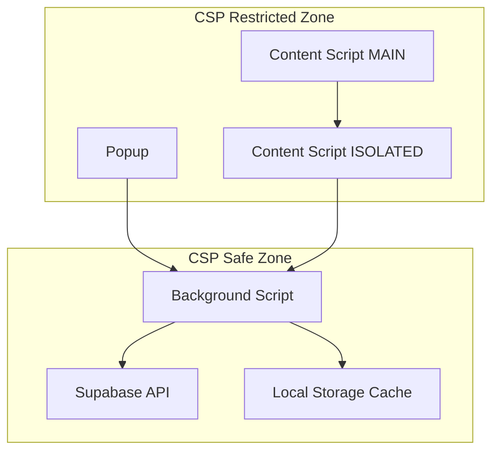

# Design Document

## Overview

The CSP Supabase Fix addresses Content Security Policy violations that prevent direct API calls to Supabase from content scripts and popup contexts. The solution implements a message-passing architecture that routes all Supabase operations through the background script, which has the necessary permissions to make external API calls.

The current implementation already has partial solutions in place, but they need to be consolidated and optimized for reliability and maintainability.

## Architecture

### Current State Analysis

The extension currently has three different approaches for Supabase communication:

1. **Direct Supabase Client**: Using `@supabase/supabase-js` in background script (works but inconsistent)
2. **Raw Fetch API**: Direct HTTP calls to Supabase REST API (partially implemented)
3. **Message Passing**: MAIN world → ISOLATED world → Background script (complex but necessary)

### Proposed Architecture



### Message Flow

1. **Content Script (MAIN world)** extracts chat data and sends via `postMessage`
2. **Content Script (ISOLATED world)** receives message and forwards via `chrome.runtime.sendMessage`
3. **Background Script** processes request, makes Supabase API call, returns response
4. **Error Handling** includes retry logic and local caching for offline scenarios

## Components and Interfaces

### 1. Unified Supabase Service (Background Script)

**Purpose**: Centralized service for all Supabase operations with consistent error handling and retry logic.

**Interface**:

```typescript
interface SupabaseService {
  insertChatMessages(messages: ChatMessage[]): Promise<SupabaseResponse>;
  queryChatHistory(conversationId: string): Promise<ChatMessage[]>;
  testConnection(): Promise<ConnectionStatus>;
}

interface ChatMessage {
  conversation_id: string;
  message_id: string;
  role: "user" | "assistant";
  content: string;
  created_at: string;
}

interface SupabaseResponse {
  success: boolean;
  data?: any;
  error?: string;
  retryCount?: number;
}
```

### 2. Message Passing Bridge

**Purpose**: Standardized communication layer between different extension contexts.

**Interface**:

```typescript
interface ExtensionMessage {
  type: "SUPABASE_OPERATION";
  action: "insert" | "query" | "test";
  data: any;
  requestId: string;
}

interface ExtensionResponse {
  success: boolean;
  data?: any;
  error?: string;
  requestId: string;
}
```

### 3. Retry and Cache Manager

**Purpose**: Handle network failures and provide offline functionality.

**Interface**:

```typescript
interface CacheManager {
  cacheForRetry(operation: SupabaseOperation): Promise<void>;
  getFailedOperations(): Promise<SupabaseOperation[]>;
  clearCache(): Promise<void>;
  syncCachedOperations(): Promise<SyncResult>;
}
```

## Data Models

### Chat Message Schema

```typescript
interface ChatMessage {
  conversation_id: string; // UUID from ChatGPT URL
  message_id: string; // Unique identifier for each message
  role: "user" | "assistant"; // Message sender type
  content: string; // Message text content
  created_at: string; // ISO timestamp
}
```

### Operation Cache Schema

```typescript
interface CachedOperation {
  id: string;
  operation: "insert" | "update" | "delete";
  table: string;
  data: any;
  timestamp: string;
  retryCount: number;
  lastError?: string;
}
```

## Error Handling

### 1. Network Errors

- **Retry Logic**: Exponential backoff with max 3 attempts
- **Offline Caching**: Store failed operations in chrome.storage.local
- **Auto-sync**: Retry cached operations when network is restored

### 2. CSP Violations

- **Detection**: Monitor for CSP-related errors in console
- **Fallback**: Ensure all operations route through background script
- **Logging**: Detailed error reporting for debugging

### 3. API Errors

- **Supabase Errors**: Parse and handle specific error codes
- **Authentication**: Handle expired tokens and re-authentication
- **Rate Limiting**: Implement backoff for rate limit responses

### Error Response Format

```typescript
interface ErrorResponse {
  success: false;
  error: string;
  errorCode?: string;
  details?: any;
  retryable: boolean;
  retryAfter?: number;
}
```

## Testing Strategy

### 1. Unit Tests

- **Supabase Service**: Mock API responses and test error handling
- **Message Passing**: Test communication between contexts
- **Cache Manager**: Test offline scenarios and sync logic

### 2. Integration Tests

- **End-to-End Flow**: Content script → Background → Supabase
- **Error Scenarios**: Network failures, CSP violations, API errors
- **Performance**: Large message batches and concurrent operations

### 3. Manual Testing

- **CSP Validation**: Verify no console errors in different contexts
- **Offline Testing**: Disconnect network and verify caching
- **Cross-browser**: Test in Chrome, Edge, and other Chromium browsers

### Test Data Setup

```typescript
const mockChatMessages = [
  {
    conversation_id: "test-conv-123",
    message_id: "msg-1",
    role: "user",
    content: "Test user message",
    created_at: new Date().toISOString(),
  },
  // ... more test messages
];
```

## Implementation Notes

### 1. Background Script Optimization

- Remove duplicate Supabase client and fetch implementations
- Consolidate into single service with consistent error handling
- Add proper TypeScript interfaces for all operations

### 2. Content Script Simplification

- Remove multiple sync button implementations
- Standardize on single message passing approach
- Add proper error feedback to user interface

### 3. Configuration Management

- Move hardcoded Supabase credentials to environment variables
- Add configuration validation on extension startup
- Implement secure credential storage

### 4. Performance Considerations

- Batch multiple messages into single API calls
- Implement debouncing for rapid DOM changes
- Add request deduplication to prevent duplicate operations

### 5. Security Enhancements

- Validate all message data before processing
- Sanitize content to prevent XSS in stored data
- Implement proper CORS handling for Supabase requests
